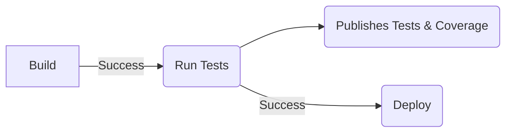

# A template project for deploying a Python API with CI/CD integrated to the Azure Cloud

This project aims to provide a template project to quickly develop an API (written in python) and deploy it to Azure Web App in a very short time. It includes a CI/CD pipeline which will test the code (unit and integration), provide you with a nice test results and coverage tabs within Azure DevOps, it will also deploy automatically your code by pushing the image to the docker registry (Docker Hub) which will be retrieved by the Azure Web App automatically performing a Continous Deployment of your project.

## Stack

- Git

- Poetry (package manager)

- Python + FastAPI

- Pytest + Coverage (pycov)

- Azure Pipelines / Azure DevOps

- Azure Cloud (Deployment to an Azure Web App)

- Docker and Docker-compose (for local deployment).

- Docker Hub (As a container registry).

## Introduction

This documentation is splited in two parts, the first one covers the project set up, the second one, inside of the 'deploy' folder you'll find instructions on how to set up the infrastructure either manually or by running the infrastructure pipeline. The documentation is aimed to be written in such a way that a person who didn't have any contact with Azure Cloud or Python before would be able to have this project up and running. (it obviously assumes that you are developer and/or have some programming skills in any other language).

## Infrastructure

 For the infrastructure set up, refer to the [README.md](https://github.com/bauca/PythonAPIAzureTemplate/blob/develop/deploy/README.md) file in the `/deploy` folder.

## Set up & requirements

### Minimum Requirements

- OS: Linux, MacOS or Windows with WSL installed (linux subsystem for windows)

- Docker (tested with version 4.5.1 )

- Python (Preferebly the latest stable version 3.10.4)

*I recommend [pyenv](https://github.com/pyenv/pyenv) for managing multiple python versions.

### Setup

- Install poetry using [pip](https://pip.pypa.io/en/stable/getting-started/) (the default python package manager):

> pip install poetry

- Clone the repository:

>git clone <https://github.com/bauca/PythonAPIAzureTemplate.git>

- Inside of the folder 'PythonAPIAzureTemplate/src/backend', install the packages using [Poetry](https://python-poetry.org/):

> poetry install

With the steps aboves you should have the enviroment set up for running the project.

## Running

Inside of the 'PythonAPIAzureTemplate/backend/src' folder run:

- Running the API (outside of a docker container)

> poetry run uvicorn api.main_api:app --host 0.0.0.0 --port 8000

- Running from docker using docker-compose from the 'PythonAPIAzureTemplate' folder:

> docker-compose -f deploy/docker/docker-compose.yml up --build

This will build and run your code and make your api available locally.

## Testing locally

From the folder PythonAPIAzureTemplate/src/backend:

Run:

> poetry run pytest tests/

## Deployment

The deployment pipeline works as following:

1. Builds the image.

2. Runs the Unit and Integration tests.

3. Generates the tests reports and coverage.

4. Push the image to the Docker Hub (Continous deployment)

